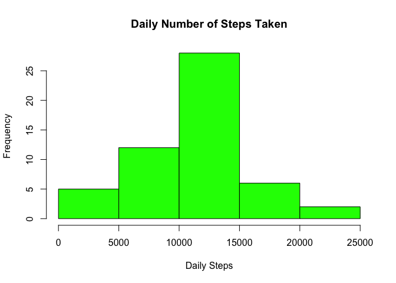
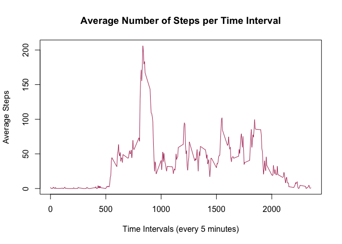
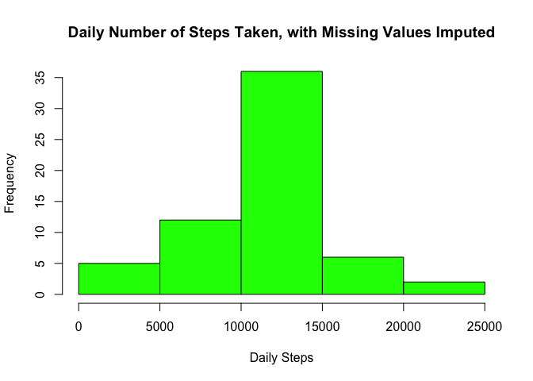
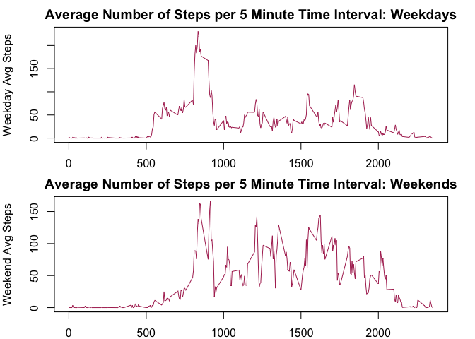

# Reproducible Research: Peer Assessment 1


## Objective


This R Markdown document is for Programming Assignment 1 of the Data Science Specialization Course: Reproducible Research. The tasks are to analyze data on number of steps taken by a user wearing a personal activity monitoring device.

Relevant details of the data from the course assignment page instructions:

> This assignment makes use of data from a personal activity monitoring device. This device collects data at 5 minute intervals through out the day. The data consists of two months of data from an anonymous individual collected during the months of October and November, 2012 and include the number of steps taken in 5 minute intervals each day.

> Variables in dataset:  
> steps: Number of steps taking in a 5-minute interval (missing values are coded as NA)  
> date: The date on which the measurement was taken in YYYY-MM-DD format  
> interval: Identifier for the 5-minute interval in which measurement was taken  
> The dataset is stored in a comma-separated-value (CSV) file and there are a total of 17,568 observations in this dataset.  

## Assignment

### Step 1: Loading and Preprocessing the Data

1. Load the data (i.e. read.csv())

2. Process/transform the data (if necessary) into a format suitable for your analysis


```r
unzip("activity.zip")  # assumes you have set working directory appropriately

rawdat <- read.csv("activity.csv") 

# str(rawdat)
# summary(rawdat)
```

Findings:
- 2304 missing in steps variable, 15264 are not missing
- 61 days of data, 288 measurements per day (12/hour times 24 hours)
- mean 37, max 806 steps in 5 min intervals. 
- is 806 steps plausible? 300 sec, so almost 3 steps per second... plot says they are not outliers


### Step 2: What is mean total number of steps taken per day?

For this part of the assignment, you can ignore the missing values in the dataset.

1. Make a histogram of the total number of steps taken each day

2. Calculate and report the mean and median total number of steps taken per day


```r
dat <- rawdat[!is.na(rawdat$steps), ]
library(plyr)
dailySteps <- aggregate(steps ~ date, dat, sum)
hist(dailySteps$steps, main="Daily Number of Steps Taken", 
     xlab = "Daily Steps", col="green")
```

 

```r
meanSteps <- mean(dailySteps$steps)
medianSteps <- median(dailySteps$steps)
print(paste0("Mean steps per day: ", round(meanSteps), 
             ". Median steps per day: ", round(medianSteps), "."))
```

```
## [1] "Mean steps per day: 10766. Median steps per day: 10765."
```


### Step 3: What is the average daily activity pattern?

1. Make a time series plot (i.e. type = "l") of the 5-minute interval (x-axis) and the average number of steps taken, averaged across all days (y-axis)

2. Which 5-minute interval, on average across all the days in the dataset, contains the maximum number of steps?


```r
intervalSteps <- aggregate(steps ~ interval, dat, mean)
plot(intervalSteps$interval, intervalSteps$steps, type="l", col="maroon", 
     main="Average Number of Steps per Time Interval", 
     xlab="Time Intervals (every 5 minutes)", ylab="Average Steps")
```

 

```r
maxSteps <- max(intervalSteps$steps)
print(paste0("Time interval with the largest average number of steps: interval # ",
             intervalSteps[intervalSteps$steps==maxSteps, 1], ", with steps = ",
             round(intervalSteps[intervalSteps$steps==maxSteps, 2])))
```

```
## [1] "Time interval with the largest average number of steps: interval # 835, with steps = 206"
```


### Step 4: Imputing missing values

Note that there are a number of days/intervals where there are missing values (coded as NA). The presence of missing days may introduce bias into some calculations or summaries of the data.

1. Calculate and report the total number of missing values in the dataset (i.e. the total number of rows with NAs)

2. Devise a strategy for filling in all of the missing values in the dataset. The strategy does not need to be sophisticated. For example, you could use the mean/median for that day, or the mean for that 5-minute interval, etc.

3. Create a new dataset that is equal to the original dataset but with the missing data filled in.

4. Make a histogram of the total number of steps taken each day and Calculate and report the mean and median total number of steps taken per day. Do these values differ from the estimates from the first part of the assignment? What is the impact of imputing missing data on the estimates of the total daily number of steps?


```r
missing <- rawdat[is.na(rawdat$steps), ]
print(paste0("The total number of missing values in the Steps dataset: ", nrow(missing)))
```

```
## [1] "The total number of missing values in the Steps dataset: 2304"
```

```r
# impute missing values: use average of that interval over all days 
notmissing <- rawdat[!is.na(rawdat$steps), ]
missing <- missing[, 2:3] # before merging, remove the steps column that is all NA
merged <- merge(missing, intervalSteps, by="interval")
merged <- merged[order(merged$date, merged$interval), ]

# full dataset with missing values now replaced with imputed values:
imputed <- rbind(notmissing, merged)
imputed <- imputed[order(imputed$date, imputed$interval), ]

# histogram, mean and median of this revised dataset (essentially repeat step 2 on this dataset)
idailySteps <- aggregate(steps ~ date, imputed, sum)
hist(idailySteps$steps, main="Daily Number of Steps Taken, with Missing Values Imputed", 
     xlab = "Daily Steps", col="green")
```

 

```r
imeanSteps <- mean(idailySteps$steps)
imedianSteps <- median(idailySteps$steps)
print(paste0("Mean steps per day: ", round(imeanSteps), 
             ". Median steps per day: ", round(imedianSteps), "."))
```

```
## [1] "Mean steps per day: 10766. Median steps per day: 10766."
```

####Observations: Comparing the histogram, mean and median with imputed NA values versus excluding the NA values:
The histogram differs since it is total number of steps, it is increased after including imputed values.  
The means are numerically the same, though computationally different.  
The medians are numerically and computationally different (though very close numerically).  


### Step 5: Are there differences in activity patterns between weekdays and weekends?

For this part the weekdays() function may be of some help here. Use the dataset with the filled-in missing values for this part.

1. Create a new factor variable in the dataset with two levels – "weekday" and "weekend"" indicating whether a given date is a weekday or weekend day.

2. Make a panel plot containing a time series plot (i.e. type = "l") of the 5-minute interval (x-axis) and the average number of steps taken, averaged across all weekday days or weekend days (y-axis). 


```r
imputed$date <- as.POSIXlt(imputed$date)
imputed$day <- weekdays(imputed$date)
imputed$daytype <- ifelse(imputed$day %in% c("Saturday", "Sunday"), "weekend", "weekday")

weekdaySteps <- aggregate(steps ~ interval, imputed[imputed$daytype=="weekday", ], mean)
weekendSteps <- aggregate(steps ~ interval, imputed[imputed$daytype=="weekend", ], mean)

par(mfrow = c(2,1), mar = c(2,4,2,2))
plot(weekdaySteps$interval, weekdaySteps$steps, type="l", col="maroon", 
     main="Average Number of Steps per 5 Minute Time Interval: Weekdays", 
     ylab="Weekday Avg Steps")

plot(weekendSteps$interval, weekendSteps$steps, type="l", col="maroon", 
     main="Average Number of Steps per 5 Minute Time Interval: Weekends", 
     ylab="Weekend Avg Steps")
```

 

